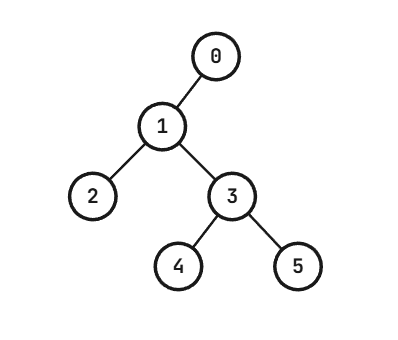

# [Codeforces 2195E : Idiot First Search](https://codeforces.com/contest/2195/problem/E)

## 문제 설명

There is a binary tree of n+1 vertices (n is odd), with vertices labeled $0,1,\ldots,n$. At most one letter can be written on each vertex of the tree, and all vertices initially have nothing written on them. The root of the tree is vertex 0.

In the tree, vertex 0 is the parent of vertex 1, while all other vertices have either 2 children or 0 children.

Bob is lost in one vertex of the tree and wishes to escape the tree by reaching vertex 0. This is very easy for most people with common sense. However, since Bob is an idiot, he created a new way of traversing the tree; introducing the "Idiot First Search".

When Bob is on vertex v ($1 \le v \le n$), Bob's movement is determined as follows:

- If vertex v is a leaf, Bob always moves to the parent of v; otherwise, check the next few conditions.
- If nothing is written on vertex v, Bob writes 'L' on vertex v and moves to the left child of v;
- If 'L' is written on vertex v, Bob overwrites it to 'R' and moves to the right child of v;
- If 'R' is written on vertex v, Bob erases it and moves to the parent of v.

It takes exactly 1 second for Bob to move to an adjacent vertex, so Bob will take exactly x seconds to perform x moves.

It has been shown that regardless of which vertex Bob starts on, Bob can reach vertex 0 in a finite (though possibly inexplicably large) amount of time. We don't know who proved it; surely it can't be Bob, but it is definitely proven.

For each vertex k=$1,2,\ldots,n,$ please determine the total time it takes to reach vertex 0 if Bob started on vertex k, in seconds. As the values may be huge, you are only asked to compute them modulo $10^9+7$.

## 입력

Each test contains multiple test cases. The first line contains the number of test cases t ($1 \le t \le 10^4$). The description of the test cases follows.

The first line of each test case contains a single integer n ($1 \le n \le 300\,001$, n is odd).

Each of the next n lines contains two integers $l_i$ and $r_i$ denoting the children of vertex i ($0 \le l_i,r_i \le n$).

For each vertex, $l_i=r_i=0$ is given if the vertex has no children. Otherwise, $l_i$ and $r_i$ are the left and right children of vertex i.

It is guaranteed that the input defines a valid binary tree satisfying the conditions given in the statement.

It is guaranteed that the sum of n over all test cases does not exceed $300\,001$.

## 출력

For each test case, output n integers $\tau_1,\tau_2,\ldots,\tau_n$ separated by spaces.

Here, $\tau_k$ denotes the total time it takes to reach vertex 0 if Bob started on vertex k, modulo $10^9+7$.

## 노트

On the first test case, there are only two vertices, vertex 0 and vertex 1. It takes only 1 second for Bob to reach vertex 0 from vertex 1.

On the second test case, the tree is given as follows.



It takes 14 seconds for Bob to reach vertex 0 from vertex 3. The moves are as follows:

$3 \xrightarrow{\mathtt{L}} 4 \xrightarrow{\mathtt{X}} 3 \xrightarrow{\mathtt{R}} 5 \xrightarrow{\mathtt{X}} 3 \xrightarrow{\mathtt{X}} 1 \xrightarrow{\mathtt{L}} 2 \xrightarrow{\mathtt{X}} 1 \xrightarrow{\mathtt{R}} 3 \xrightarrow{\mathtt{L}} 4 \xrightarrow{\mathtt{X}} 3 \xrightarrow{\mathtt{R}} 5 \xrightarrow{\mathtt{X}} 3 \xrightarrow{\mathtt{X}} 1 \xrightarrow{\mathtt{X}} 0$

Here, the letters above the arrows denote the letter on the vertex before moving to the adjacent vertex, where $\mathtt{X}$ denotes nothing written.

## 예제

### 1

#### 입력

```
3
1
0 0
5
2 3
0 0
4 5
0 0
0 0
7
2 3
4 5
0 0
6 7
0 0
0 0
0 0
```

#### 출력

```
1
9 10 14 15 15
13 22 14 27 23 28 28
```

## 티어(난이도)


## 제한

| 시간 | 메모리 |
|:----:|:------:|
| 2초  | 512MB  |

## 알고리즘 분류

