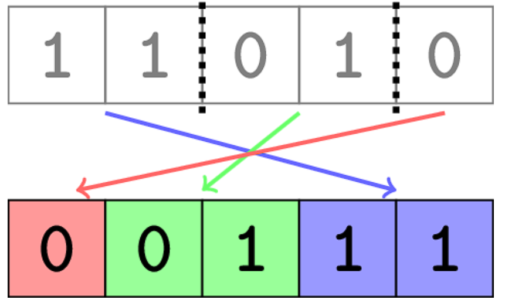

# [Codeforces 1971D : Binary Cut](https://codeforces.com/problemset/problem/1971/D)

## 문제 설명

You are given a binary $string^{\dagger}$. Please find the minimum number of pieces you need to cut it into, so that the resulting pieces can be rearranged into a sorted binary string.



Note that:

- each character must lie in exactly one of the pieces;
- the pieces must be contiguous substrings of the original string;
- you must use all the pieces in the rearrangement.

$^{\dagger}$ A binary string is a string consisting of characters $\texttt{0}$ and $\texttt{1}$. A sorted binary string is a binary string such that all characters $\texttt{0}$ come before all characters $\texttt{1}$.

## 입력

The first line contains a single integer t ($1 \leq t \leq 500$) — the number of test cases.

The only line of each test case contains a single string s ($1 \leq |s| \leq 500$) consisting of characters $\texttt{0}$ and $\texttt{1}$, where |s| denotes the length of the string s.

## 출력

For each test case, output a single integer — the minimum number of pieces needed to be able to rearrange the string into a sorted binary string.

## 노트

The first test case is pictured in the statement. It can be proven that you can't use fewer than 3 pieces.

In the second and third test cases, the binary string is already sorted, so only 1 piece is needed.

In the fourth test case, you need to make a single cut between the two characters and rearrange them to make the string $\texttt{01}$.

## 예제

### 1

#### 입력

```
6
11010
00000000
1
10
0001111
0110
```

#### 출력

```
3
1
1
2
1
2
```

## 티어(난이도)

1100

## 제한

| 시간 | 메모리 |
|:----:|:------:|
| 2초  | 256MB  |

## 알고리즘 분류

- dp
- greedy
- implementation
- sortings
- strings