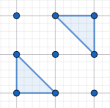

# [Codeforces 2195H : Codeforces Heuristic Contest 001](https://codeforces.com/contest/2195/problem/H)

## 문제 설명

There is a grid of $3n \times 3n$ points, consisting of all integer points (x,y) such that $1 \le x,y \le 3n$.

Find a largest set of triangles satisfying the following conditions:

- Each triangle has its vertices on exactly three points on the grid.
- Each triangle has an area of exactly $\frac{1}{2}$. Note that they do not have to be right triangles.
- No two triangles share a common intersection point, including their vertices.

If there exist multiple largest such sets of triangles, you may output any of them.

## 입력

Each test contains multiple test cases. The first line contains the number of test cases t ($1 \le t \le 30$). The description of the test cases follows.

The only line of each test case contains a single integer n ($1 \le n \le 166$).

It is guaranteed that the sum of $n^2$ over all test cases does not exceed $166^2$.

## 출력

Output the maximum size m of the set of triangles on one line ($0 \le m \le 3n^2$).

Then, output m lines in the following format:

$x_{i,1}\;y_{i,1}\;x_{i,2}\;y_{i,2}\;x_{i,3}\;y_{i,3}$: The vertices of the i-th triangle are $(x_{i,1},y_{i,1}), (x_{i,2},y_{i,2}), (x_{i,3},y_{i,3})$.
You may output the vertices of one triangle in any order (clockwise or counterclockwise).

Your output will be accepted if it satisfies all conditions and the maximum size given is correct.

## 노트

In the first test case, the example output has 2 triangles as shown in the following image:



In the second test case, the example output has 12 triangles as shown in the image on the left:


As the triangles are not required to be right triangles, the set of triangles shown in the image on the right will also be considered valid.


## 예제

### 1

#### 입력

```
2
1
2
```

#### 출력

```
2
1 1 1 2 2 1
2 3 3 2 3 3
12
1 1 1 2 2 1
2 2 3 2 3 1
1 3 1 4 2 3
2 4 3 4 3 3
1 5 1 6 2 5
2 6 3 6 3 5
4 1 4 2 5 1
5 2 6 2 6 1
4 3 4 4 5 3
5 4 6 4 6 3
4 5 4 6 5 5
5 6 6 6 6 5
```

## 티어(난이도)


## 제한

| 시간 | 메모리 |
|:----:|:------:|
| 4초  | 1024MB  |

## 알고리즘 분류

